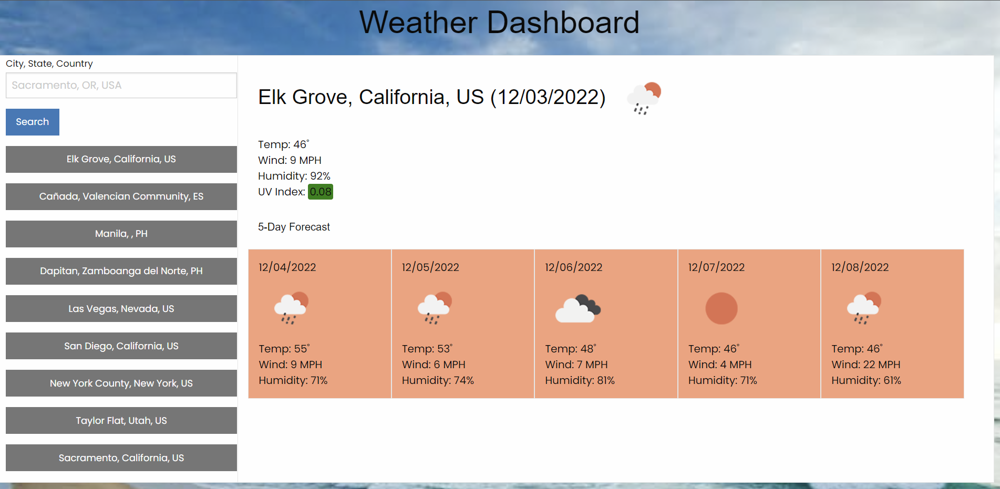

# Five Day Weather Forecast

Using this app, the user can check the weather 5 days ahead of time. It is free to use and can input any location as long as the user is connected to internet.

## Technologies used

HTML,
CSS,
javaScript,
Moment,
Google Font,
jQuery, and
Open Weather API

## Image

## Link

https://zg4219.github.io/Weather-Forecast/
